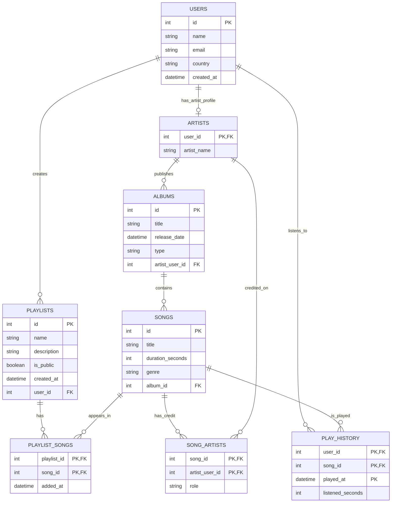

# Spotify

## Esquema

```mermaid
erDiagram
    USERS ||--o| ARTISTS : has_artist_profile
    USERS ||--o{ PLAYLISTS : creates
    ARTISTS ||--o{ ALBUMS : publishes
    ALBUMS ||--o{ SONGS : contains

    PLAYLISTS ||--o{ PLAYLIST_SONGS : has
    SONGS ||--o{ PLAYLIST_SONGS : appears_in

    SONGS ||--o{ SONG_ARTISTS : has_credit
    ARTISTS ||--o{ SONG_ARTISTS : credited_on

    USERS ||--o{ PLAY_HISTORY : listens_to
    SONGS ||--o{ PLAY_HISTORY : is_played

    USERS {
        int id PK
        string name
        string email
        string country
        datetime created_at
    }

    ARTISTS {
        int user_id PK, FK
        string artist_name
    }

    ALBUMS {
        int id PK
        string title
        datetime release_date
        string type
        int artist_user_id FK
    }

    SONGS {
        int id PK
        string title
        int duration_seconds
        string genre
        int album_id FK
    }

    PLAYLISTS {
        int id PK
        string name
        string description
        boolean is_public
        datetime created_at
        int user_id FK
    }

    PLAYLIST_SONGS {
        int playlist_id PK, FK
        int song_id PK, FK
        datetime added_at
    }

    SONG_ARTISTS {
        int song_id PK, FK
        int artist_user_id PK, FK
        string role
    }

    PLAY_HISTORY {
        int user_id PK, FK
        int song_id PK, FK
        datetime played_at PK
        int listened_seconds
    }
```